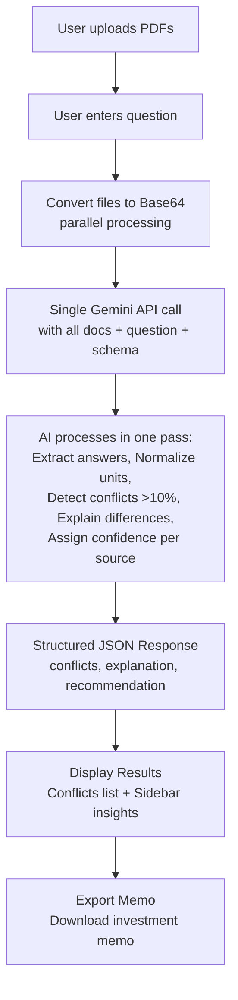

# CLASH

## Why

Market research docs disagree. Same question, different numbers. CLASH finds conflicts and explains why.

## What

Upload docs. Ask question. Get conflicts with source, confidence, explanation, recommendation. Export memo.

**Flow:**
```
Upload → Question → AI Extract → Find Conflicts → Show Results → Export
```

## How

**Local Development:**
1. `npm install`
2. Install Wrangler CLI: `npm i -g wrangler`
3. Create `.dev.vars`: `GEMINI_API_KEY=your_key`
4. Run: `npm run pages:dev` (runs frontend + API routes)

**Deploy to Cloudflare Pages (Free):**
1. Push to GitHub
2. Go to [Cloudflare Dashboard](https://dash.cloudflare.com) > Pages
3. Connect repository
4. Build settings:
   - Build command: `npm run build`
   - Output directory: `dist`
5. Add environment variable: `GEMINI_API_KEY=your_key`
6. Deploy

**Why Cloudflare:**
- **Free tier**: 100MB request limit (supports 30MB files)
- **Unlimited requests** on free tier
- **Fast global CDN**
- **No credit card required**

API key secured server-side via `/api/analyze` route.

## Info Flow



**Extraction/Cleaning:**
- AI extracts answers from all docs in one pass
- AI normalizes units per prompt instruction
- AI groups conflicts and flags >10% differences per prompt
- AI assigns confidence (High/Medium/Low) per source reliability

**Presentation:**
- Conflicts list: value, source, confidence badge, context (with page numbers)
- Sidebar: explanation (why conflicts exist), recommendation (which to trust)
- Export: investment memo with all data points and sources
