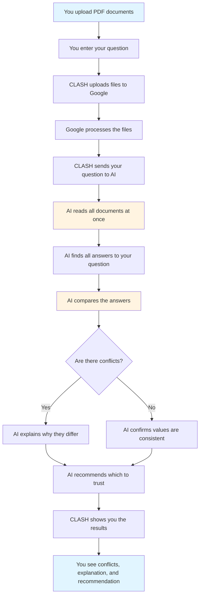

# CLASH

## Why

When researching a market or company, you often find multiple reports with different numbers. One report says the market is $20 billion, another says $25 billion. Which one is right? Why do they disagree?

CLASH helps you find these conflicts and understand why they exist, so you can make better decisions.

## What

CLASH is a tool that:

1. **Takes your documents** - Upload multiple PDF reports
2. **Answers your question** - Ask something like "What is the market size?"
3. **Finds conflicts** - Shows you where the documents disagree
4. **Explains why** - Tells you why the numbers differ (different timeframes, methodologies, etc.)
5. **Recommends** - Suggests which source to trust and why

**Simple flow:**
```
Upload documents → Ask question → Get conflicts and explanation → Make decision
```

## How

### Using CLASH

1. **Upload your documents** - Drag and drop PDF files (up to 30MB each)
2. **Enter your question** - Type what you want to know (e.g., "What is the market size?")
3. **Review results** - See all conflicting values, explanations, and recommendations
4. **Export** - Download a summary memo with all findings

### Running CLASH Yourself

**Local Development:**
1. Install dependencies: `npm install`
2. Install Wrangler: `npm i -g wrangler`
3. Create `.dev.vars` file with your Gemini API key: `GEMINI_API_KEY=your_key`
4. Run: `npm run pages:dev`

**Deploy to Cloudflare Pages:**
1. Push your code to GitHub
2. Go to Cloudflare Dashboard → Pages
3. Connect your repository
4. Set build command: `npm run build`
5. Set output directory: `dist`
6. Add environment variable: `GEMINI_API_KEY=your_key` (for Production)
7. Deploy

**Why Cloudflare Pages:**
- Free tier supports large files (up to 30MB)
- No credit card required
- Fast and reliable

## Information Flow

Here's how CLASH processes your documents:



## How It Works

**Step 1: Upload**
- You upload multiple PDF documents
- Files are sent to Google's servers for processing

**Step 2: Question**
- You ask a specific question (e.g., "What is the market size?")
- The question is sent along with references to your uploaded documents

**Step 3: AI Analysis**
- The AI reads all your documents at the same time
- It finds every answer to your question from each document
- It converts different units to the same format (e.g., all to billions)
- It compares the answers to find conflicts (differences greater than 10%)

**Step 4: Results**
- Shows you all the conflicting values
- Explains why they differ (different dates, methods, definitions)
- Recommends which source is most reliable
- Lets you export everything as a memo

## What Makes It Different

- **Compares multiple documents** - Not just one at a time
- **Finds conflicts automatically** - Flags differences greater than 10%
- **Explains why** - Not just what the numbers are, but why they differ
- **Source tracking** - Shows which document each value came from
- **Confidence levels** - Tells you how reliable each source is

## Technical Notes

- Maximum file size: 30MB per file
- Supports multiple files at once
- Works entirely in your browser (no data stored on servers)
- Uses Google's Gemini AI for analysis
